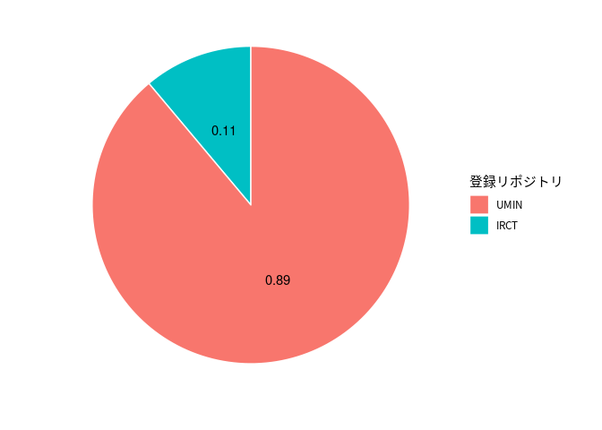
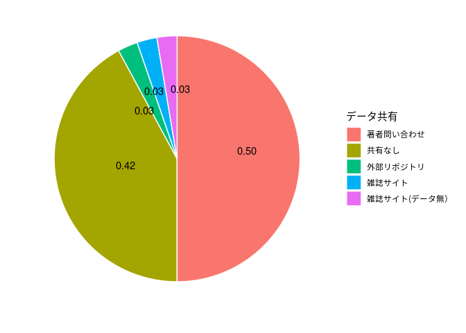

変数メモ
paper:
type:
with_data:(データを扱っている=1,扱っていない=0)Reviewは0とする。
pre_registered： 事前登録なし，事前登録あり，事後登録あり
where_pre-registered：事前登録サイト
share_data：
share_code：

# 使用するRパッケージ


```r
library(tidyverse)
library(ggrepel)
```


# データの読み込み


```r
setwd("../data")
data <- read_csv("data.csv")
```

# 事前登録


```r
data %>% 
  filter(with_data == 1) %>% 
  select(pre_registered) %>% 
  mutate(n = 1) %>% 
  group_by(pre_registered) %>% 
  summarize(total = sum(n)) %>% 
  mutate(percentage = total/sum(total)) %>% 
  mutate(label = paste0(pre_registered, "\n", scales::percent(percentage, 0.1))) %>%
  ggplot(aes(x = "", y = total, fill = factor(total))) +
    geom_col() + 
    coord_polar("y") +
    geom_text_repel(aes(label = label), position = position_stack(vjust = 0.5)) +
    theme_void() + 
    theme(legend.position = "none")
```

<!-- -->

# 事前登録で用いたリポジトリ


```r
data %>% 
  filter(with_data == 1 & pre_registered != "事前登録なし") %>% 
  select(where_pre_registered) %>% 
  mutate(n = 1) %>% 
  group_by(where_pre_registered) %>% 
  summarize(total = sum(n)) %>% 
  mutate(percentage = total/sum(total)) %>% 
  mutate(label = paste0(where_pre_registered, "\n", scales::percent(percentage, 0.1))) %>%
  ggplot(aes(x = "", y = total, fill = factor(total))) +
    geom_col() + 
    coord_polar("y") +
    geom_text_repel(aes(label = label), position = position_stack(vjust = 0.5)) +
    theme_void() + 
    theme(legend.position = "none")
```

<!-- -->


# データ共有

重なりを解消したい・・・


```r
data %>% 
  filter(with_data == 1) %>% 
  select(share_data) %>% 
  mutate(n = 1) %>% 
  group_by(share_data) %>% 
  summarize(total = sum(n)) %>% 
  mutate(percentage = total/sum(total)) %>% 
  mutate(label = paste0(share_data, "\n", scales::percent(percentage, 0.1))) %>%
  ggplot(aes(x = "", y = total, fill = factor(total))) +
    geom_col() + 
    coord_polar("y") +
    geom_text(aes(label = label), position = position_stack(vjust = 0.5)) +
    theme_void() + 
    theme(legend.position = "none")
```

<!-- -->

# コード共有


```r
data %>% 
  filter(with_data == 1) %>% 
  select(share_code) %>% 
  mutate(n = 1) %>% 
  group_by(share_code) %>% 
  summarize(total = sum(n)) %>% 
  mutate(percentage = total/sum(total)) %>% 
  mutate(label = paste0(share_code, "\n", scales::percent(percentage, 0.1))) %>%
  ggplot(aes(x = "", y = total, fill = factor(total))) +
    geom_col() + 
    coord_polar("y") +
    geom_text_repel(aes(label = label), position = position_stack(vjust = 0.5)) +
    theme_void() + 
    theme(legend.position = "none")
```

<!-- -->
